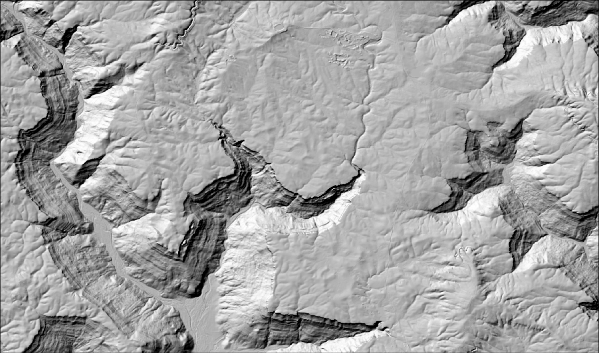

> Foster Falls Hillshade from Digital Elevation Model

# Rockfall Hazard Analysis Platform

Talus aims to mitigate one of the top causes of death / injury in outdoor rock climbing (rockfall) by providing climbers with concrete rockfall risk scores for their local wall. This is done via an end-to-end pipeline from raw DEM ingestion to route risk visualization. Freeze-thaw risk windows combined with GPU-identified source zones above a route create actionable information for mitigating rockfall hazards.

> The final project will include a CUDA-accelerated Monte Carlo simulation engine that replaces the current proximity-based risk scoring with probabilistic passage probability computed from 10,000 independent trajectory simulations per source zone.

---

## What It Does

1. Ingests a USGS 3DEP GeoTIFF DEM and USGS NGMDB geology polygons for a climbing area
2. Runs GPU-accelerated terrain analysis (slope, aspect, curvature, TRI) to identify rockfall source zones above the route
3. Fetches NOAA HRRR temperature forecasts and computes freeze-thaw risk windows for each source zone based on its aspect
4. Scores route risk using a proximity-based formula combining source zone distance, slope severity, and freeze-thaw status
5. Fires webhook alerts when risk exceeds a configured threshold
6. Displays results on a Leaflet.js map dashboard with source zone overlay, route overlay, freeze-thaw timeline, and GPU benchmark table

---

## Architecture

Four Go microservices communicating via REST, one standalone CUDA terrain binary invoked as a subprocess, and a shared PostgreSQL + PostGIS database.

```
USGS 3DEP ──► S1 Ingestion (Go) ──► S2 Terrain Preprocessing (Go)
                                              │
                                       CUDA Binary (C/CUDA)
                                       Sobel · Curvature · TRI
                                              │
NOAA NOMADS ──► S4 Hazard Analysis (Go) ◄────┘
                        │
                        ▼
               S5 API Gateway (Go) ──► Browser / Mobile Client
                        │
               PostgreSQL + PostGIS
```

---

## Services

| Service | Language | Responsibility |
|---|---|---|
| S1 — Ingestion | Go | GeoTIFF parse, GPX ingest, geology ingest |
| S2 — Terrain | Go + CUDA subprocess | GPU terrain derivatives, source zone detection |
| S4 — Hazard | Go | Proximity risk scoring, freeze-thaw compute, webhook alerts |
| S5 — Gateway | Go + Leaflet.js | REST API, static dashboard |
| PostgreSQL + PostGIS | SQL | Shared persistent store, spatial queries |

---

## Tech Stack

**Languages:** Go, C, CUDA, SQL, JavaScript, HTML, CSS

**Infrastructure:** Docker, Docker Compose, NVIDIA Container Toolkit

**Database:** PostgreSQL 15 + PostGIS 3, pgx driver, golang-migrate

**GPU:** CUDA Toolkit, CUDA Events for kernel timing

**Frontend:** Leaflet.js, vanilla JS — no build pipeline

**Observability:** Structured JSON logging via Go `log/slog`

---

## Prerequisites

- Docker and Docker Compose
- NVIDIA GPU with CUDA support
- NVIDIA Container Toolkit installed on the host
- CUDA Toolkit (for building the terrain binary)
- Go 1.22+
- `nvcc` (NVIDIA CUDA compiler)

---

## Quick Start

```bash
# Clone the repository
git clone https://github.com/eahowes/talus.git
cd talus

# Copy environment config and fill in values
cp .env.example .env

# Build the CUDA terrain binary
make cuda

# Build all Go services
make build

# Start all containers
make up

# Run database migrations
make migrate
```

The dashboard will be available at `http://localhost:8080`.

---

## Environment Variables

See `.env.example` for all required variables. Key ones:

```
POSTGRES_HOST=localhost
POSTGRES_PORT=5432
POSTGRES_DB=rockfall
POSTGRES_USER=rockfall
POSTGRES_PASSWORD=

CUDA_BINARY_PATH=/usr/local/bin/terrain

NOMADS_BASE_URL=https://nomads.ncep.noaa.gov/cgi-bin/filter_hrrr_2d.pl

S1_PORT=8001
S2_PORT=8002
S4_PORT=8004
S5_PORT=8080

RISK_PROXIMITY_THRESHOLD_M=500
RISK_SCORE_ALERT_THRESHOLD=0.7
```

---

## API Endpoints

All endpoints are served by S5 on `S5_PORT`.

| Method | Path | Description |
|---|---|---|
| POST | `/dem` | Trigger DEM ingestion for a file path or bounding box |
| POST | `/routes` | Upload a GPX route file |
| POST | `/analyze` | Trigger hazard analysis for a route |
| GET | `/routes/{id}/risk` | Fetch risk assessment and source zone proximity data |
| GET | `/freeze-thaw` | Fetch freeze-thaw windows for a date and location |
| GET | `/terrain/metrics` | Fetch GPU vs CPU benchmark data from `terrain_metrics` |
| POST | `/alerts/config` | Create or update a webhook alert configuration |
| GET | `/alerts` | Fetch alert event history |

---

## Database Schema

Three logical stores, all tables in a single PostgreSQL instance.

**Terrain Store** — raw input data written by S1
- `dem_tiles` — GeoTIFF metadata and file paths
- `geology` — rock type polygons with bounce and friction coefficients
- `routes` — GPX route LineString geometries

**Derivative Store** — GPU pipeline output written by S2
- `terrain_derivatives` — file paths to slope, aspect, curvature, TRI rasters
- `source_zones` — detected source zone polygons with mean slope and aspect
- `terrain_metrics` — GPU and CPU kernel timing records

**Analysis Store** — risk assessment output written by S4
- `route_risk_assessments` — proximity-based risk score per route/source zone pair
- `freeze_thaw_windows` — freeze-thaw predictions per source zone per forecast date
- `alert_events` — triggered alert records
- `alert_configs` — webhook endpoints and risk threshold configuration

Migrations are managed by `golang-migrate` and run automatically at S1 startup. The schema is intentionally forward-compatible — the four simulation tables added in the full project (`simulation_runs`, `simulation_metrics`, `trajectory_results`, `hazard_corridors`) are new migrations that extend the existing schema without modifying it.

---

## Risk Score

The prototype risk score is proximity-based, not probabilistic. It is a qualitative signal and is labeled as such in the dashboard.

```
risk_score = proximity_weight(nearest_source_m)
           × slope_weight(mean_slope_deg)
           × freeze_thaw_multiplier
```

Where `proximity_weight` is normalized inverse distance over the configured search radius, `slope_weight` scales linearly between the source zone detection floor (45°) and ceiling (70°), and `freeze_thaw_multiplier` is 1.5 when a freeze-thaw cycle is active for that source zone on the analysis date, 1.0 otherwise.

> When Monte Carlo simulation is added in the full project, `risk_score` is recomputed from `max_passage_prob` and `exposed_length_m`. No schema migration is required.

---

## GPU Benchmarks

Every CUDA kernel invocation writes `gpu_time_ms` and `cpu_time_ms` to the `terrain_metrics` table. The dashboard displays a live benchmark table from this data. After accumulating runs, query the aggregate:

```sql
SELECT
    kernel_name,
    AVG(gpu_time_ms)     AS mean_gpu_ms,
    AVG(cpu_time_ms)     AS mean_cpu_ms,
    AVG(throughput_mcps) AS mean_mcells_per_sec
FROM terrain_metrics
GROUP BY kernel_name;
```

---

## Data Sources

| Dataset | Source | Use |
|---|---|---|
| 3DEP DEM (1/3 arc-second) | [USGS National Map](https://apps.nationalmap.gov/downloader/) | Primary terrain input |
| National Geologic Map | [USGS NGMDB](https://ngmdb.usgs.gov/) | Rock type and simulation parameters |
| HRRR Forecasts | [NOAA NOMADS](https://nomads.ncep.noaa.gov/) | Freeze-thaw temperature forecasts |
| GPX Routes | Personal / AllTrails | Route geometries for risk intersection |

---

## Project Status

This is the prototype phase. The following are deferred to the full project:

- Service 3 — Monte Carlo trajectory simulation (Go + CUDA + cuRAND)
- CGo integration replacing the CUDA subprocess pattern
- gRPC replacing REST for inter-service communication
- Probabilistic hazard corridor geometries (PostGIS MultiPolygon)
- WebSocket real-time simulation progress
- MQTT alert delivery
- k3s Kubernetes deployment via Helm and Terraform
- Datadog observability integration
